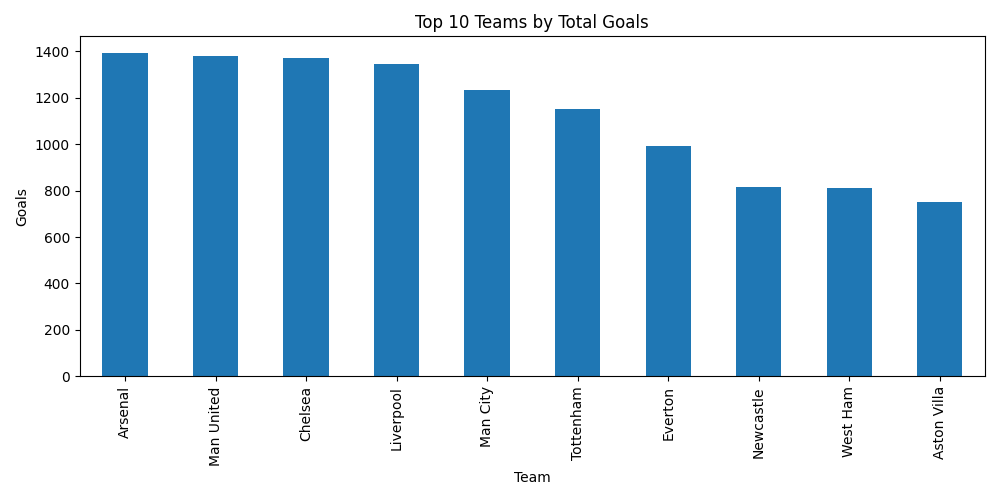
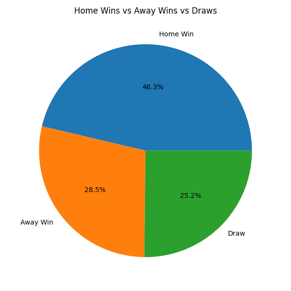
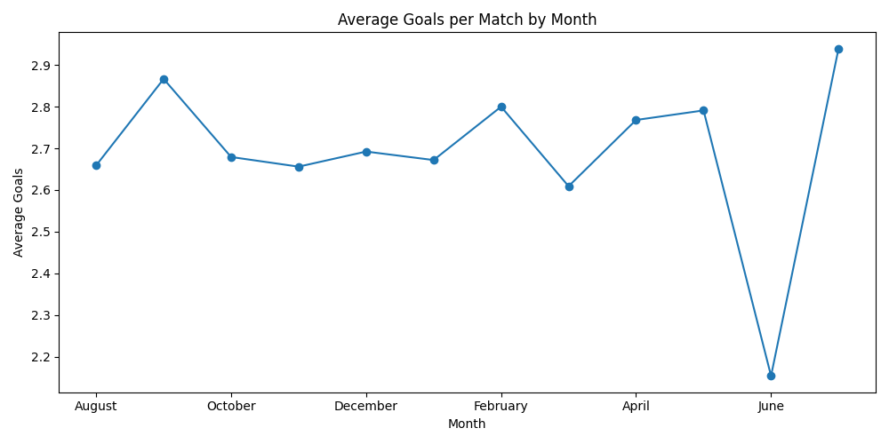

# ⚽ Football Match Analysis

## 📌 Project Overview

This project explores football match data using Python, Pandas, and Matplotlib.

The analysis focuses on team goal-scoring performance, match outcomes, home advantage, and average goals across different months.

The goal of the project was to demonstrate a complete beginner Data Science workflow:

**Data Collection → Data Cleaning → Exploratory Data Analysis → Data Visualization → Interpretation**

---

## 📊 Dataset

The original dataset contained:

* **7,404 matches**
* **104 columns**

After cleaning:

* **7,403 matches**
* **70 columns**

The dataset includes information such as match dates, home teams, away teams, goals scored, match results, and other football statistics.

---

## 🧹 Data Cleaning

The following steps were performed:

* Checked for duplicate records.
* Found **0 duplicate rows**.
* Removed **1 completely empty row**.
* Removed **34 columns** containing more than 80% missing values.
* Saved the cleaned dataset as `matches_clean.csv`.

---

## 📈 Analysis & Visualizations

### 1. Top 10 Teams by Total Goals

Home and away goals were combined to calculate each team's total goals across the dataset.

**Arsenal ranked first, followed by Manchester United.**



---

### 2. Home Advantage

The `FTR` column was used to compare home wins, away wins, and draws.

| Result   | Matches | Percentage |
| -------- | ------: | ---------: |
| Home Win |   3,428 |      46.3% |
| Away Win |   2,111 |      28.5% |
| Draw     |   1,864 |      25.2% |



The results indicate that home teams won substantially more often than away teams in the matches analyzed.

---

### 3. Average Goals by Month

Match dates were converted into datetime values and the month was extracted.

Total goals were calculated as:

**Home Goals + Away Goals**

The monthly averages were then compared.

**July had the highest average at 2.94 goals per match across 66 matches.**



---

## 🔍 Key Findings

* 🥇 **Arsenal** ranked first in total goals.
* 🥈 **Manchester United** ranked second.
* 🏠 Home teams won **46.3%** of matches.
* ✈️ Away teams won **28.5%** of matches.
* 🤝 **25.2%** of matches ended in draws.
* ⚽ **July** had the highest average goals per match at **2.94**.

---

## 🛠️ Technologies Used

* Python
* Pandas
* Matplotlib
* VS Code
* Git
* GitHub

---

## 📁 Project Structure

```text
football-data-analysis/
│
├── data/
│   ├── matches.csv
│   └── matches_clean.csv
│
├── images/
│   ├── home_advantage_pie.png
│   ├── monthly_goals.png
│   └── top_teams_goals.png
│
├── analysis.py
├── README.md
├── requirements.txt
└── .gitignore
```

---

## ▶️ How to Run

Install the required libraries:

```bash
pip3 install -r requirements.txt
```

Run the analysis:

```bash
python3 analysis.py
```

The analysis generates three charts and saves them inside the `images` folder.

---

## 📚 What I Learned

Through this project I practiced:

* Loading CSV datasets with Pandas
* Exploring data using DataFrames
* Identifying missing values
* Cleaning datasets
* Grouping and aggregating data
* Working with dates
* Calculating averages and totals
* Creating data visualizations
* Using Git and GitHub for version control

---

## 👤 Author

**Biegonnn**

This project was created as a beginner Data Science portfolio project.
